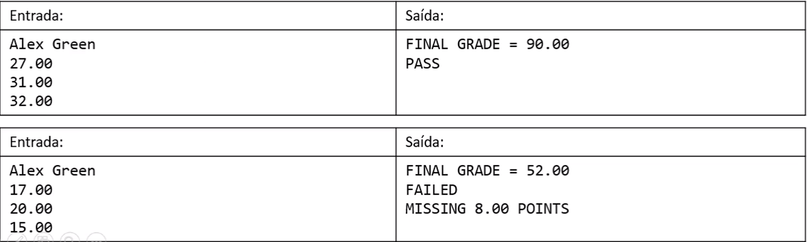

# Exercício 3
Fazer um programa para ler o nome de um aluno e três notas que ele obteve nos
três trimestres do ano ( o primeiro trimestre vale 30, o segundo e terceiro 
valem 35 cada). Ao final, mostrar qual a nota final do aluno no ano. Dizer também se o 
aluno está aprovado (PASS) ou não (FAILED) e, em caso negativo, quantos pontos faltam para
o aluno obter o mínimo para ser aprovado (que é 60% da nota).
### Exemplo: 
