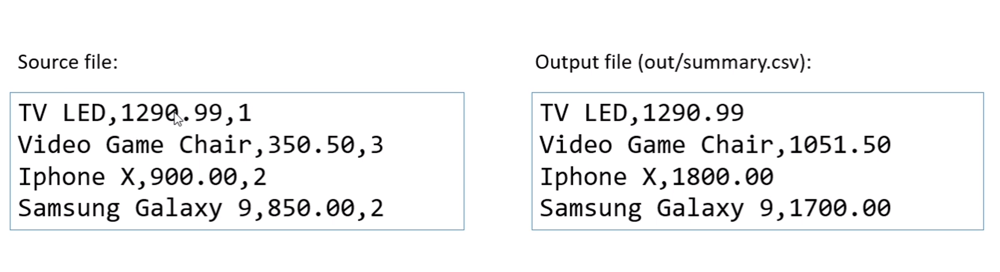

# Exercício de fixação - Trabalhando com arquivos
Fazer um programa para ler o caminho de um arquivo .csv contendo os dados
de itens vendidos. Cada item possui um nome, preço unitário e quantidade,
separados por vírgula. Você deve gerar um novo arquivo chamado "summary.csv",
localizada em uma subpasta chamada "out" a partir da pasta original do
arquivo de origem, contendo apena o nome e o valor total para aquele item
(preço unitário multiplicado pela quantidade), conforme exemplo.
### Exemplo:
