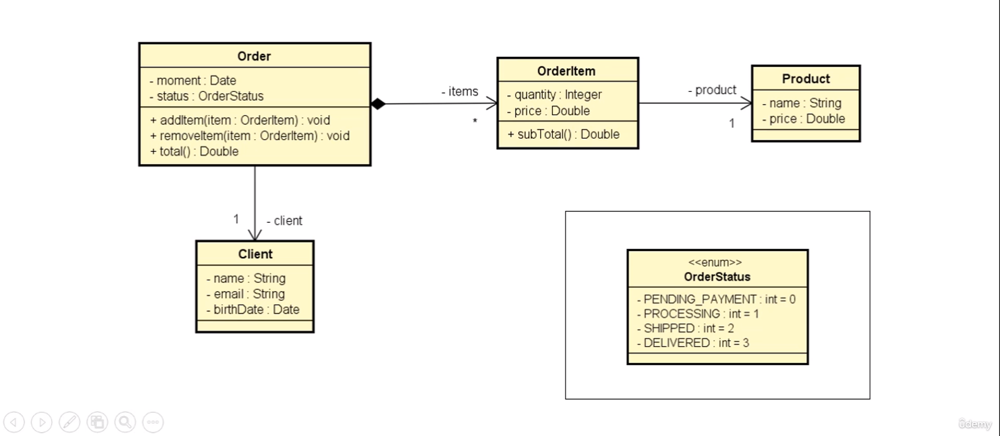

# Exercício de fixação - Enumeração e composição
Ler os dados de um pedido com N itens (N fornecido pelo usuário). Depois,
mostrar um sumário do pedido conforme exemplo. Nota: o instante do pedido
deve ser o instate do sistema.

### Modelo UML:

### Exemplo: 
