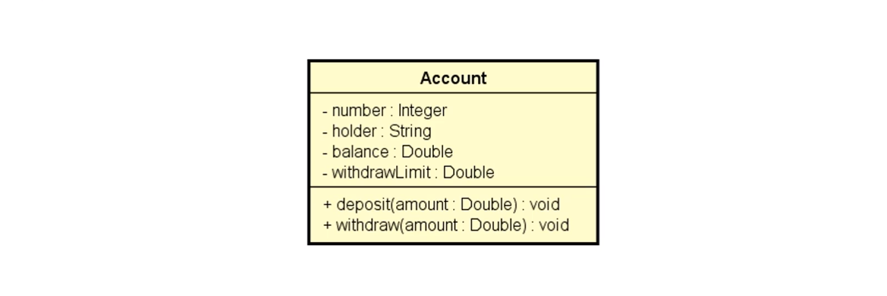
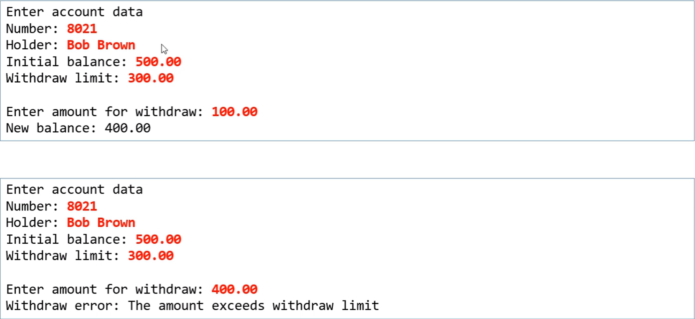
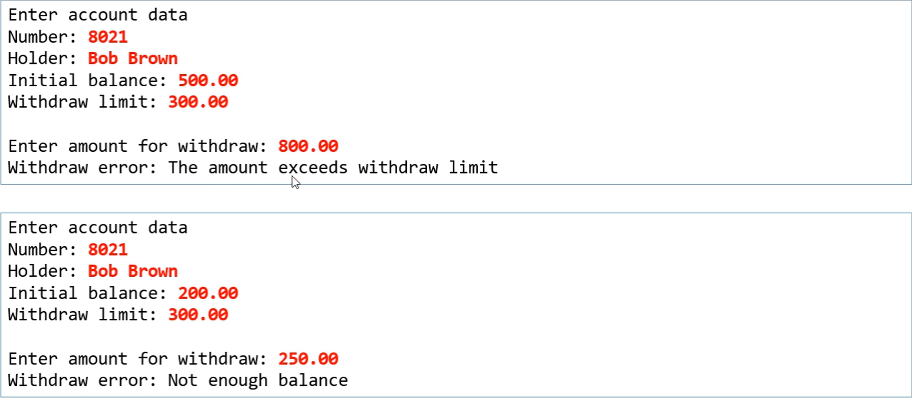

# Exercício de fixação - Tratamento de exceções
Fazer um programa para ler os dados de uma conta bancária e depois
realizar um saque nessa conta bancária, mostrando o novo saldo. um
saque não pode ocorrer se não houver saldo na conta, ou se o valor
do saque for superior ao limite de saque da conta. Implemente a conta
bancária conforme projeto abaixo.
### Modelo UML:

### Exemplos:

