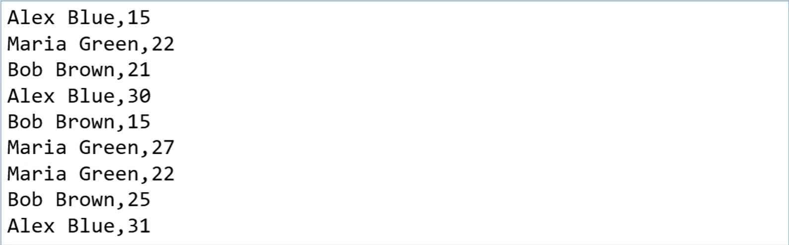
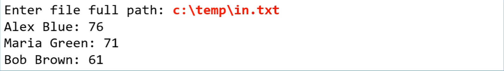

# Exercício de fixação - Coleções Map
Na contagem de votos de uma eleição, são gerados vários registos de votação
contendo o nome do candidato e a quantidade de votos (formato .csv) que ele
obteve em uma urna de votação. Você deve fazer um programa para ler os registros
de votação a partir de um arquivo, e daí gerar um relatótio consolidado com os 
totais de cada candidato.
### Exemplo do arquivo de entrada:

### Exemplo do programa:
