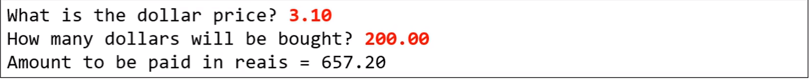

# Exercicio de fixação - Membros estáticos
Faça um programa para ler a cotação do dólar, e depois um valor em dólares a ser comprado
por uma pessoa em reais. Informar quantos reais a pessoa vai pagar pelos dólares,
considerando ainda que a pessoa terá que pagar 6% de IOF sobre o valor em dólar.
### Exemplo:
